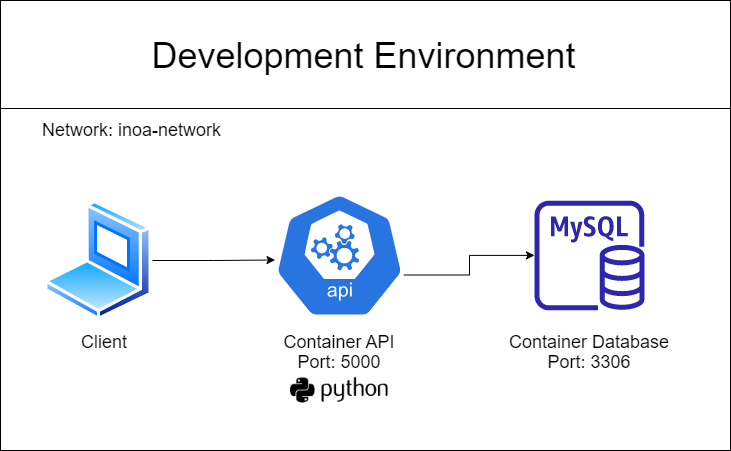

# Connecting Flask and MySQL with docker-compose    

**Note: Tested on Windows 11**

---

## Simplified Diagram



## Requeriments

- Docker Compose
- Python
- Flask


## Let's start

1. Clone this repo on your computer
```
git clone https://github.com/
```

Acessar pelo terminal do VScode ou pelo terminal do Windows acessar o local do docker-compose.yml e seguir os passos abaixo.

Usar o comando do docker para criar as imagens.<br>
`docker compose build`

Usar o comando do docker para subir os containers.<br>
`docker compose up`

No caso do SQL não iniciar antes do container da aplicação repetir o comando acima.<br>
`docker compose up`